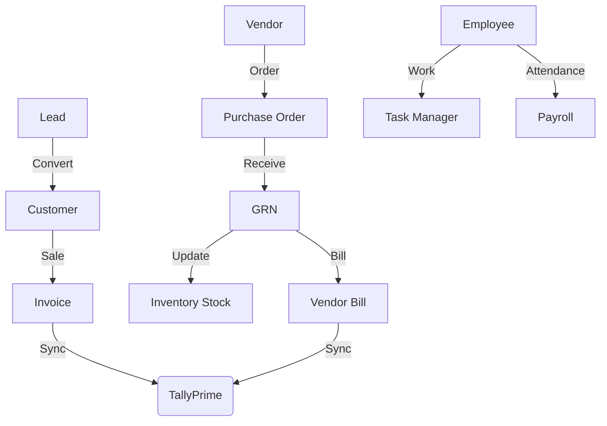

# Zen Finance ERP: Project Overview & Functional Documentation

## 1. Executive Summary
**Zen Finance ERP** is a comprehensive, enterprise-grade Enterprise Resource Planning (ERP) solution designed to streamline business operations across various departments. It integrates core business processes including CRM, Procurement, Inventory Management, Human Resources, Payroll, and Financial Accounting with native support for TallyPrime synchronization.

The platform follows a modern **MERN-like architecture** (React, Express, Node.js) but utilizes **PostgreSQL** with **Prisma ORM** for robust data integrity and complex relational mapping.

---

## 2. Technology Stack
- **Frontend**: React.js with Tailwind CSS for a premium, responsive UI.
- **Backend**: Node.js & Express.js RESTful API.
- **Database**: PostgreSQL (Relational Data Model).
- **ORM**: Prisma (Type-safe database access).
- **Authentication**: JWT (JSON Web Tokens) with Role-Based Access Control (RBAC).
- **Integration**: TallyPrime XML-based synchronization for financial data.

---

## 3. Core Modules & Functionality

### 3.1 CRM & Sales Management
Handles the complete customer lifecycle from lead acquisition to final invoicing.
- **Lead Tracking**: Capture and monitor potential business opportunities with status tracking (New, Contacted, Qualified, etc.).
- **Customer Management**: Centralized repository of customer details, GST numbers, and interaction history.
- **Invoicing System**: Generate professional tax invoices with automated GST calculations, subtotaling, and status tracking (Paid/Unpaid).
- **Payments**: Record and track customer payments against specific invoices.

### 3.2 Procurement & Vendor Management
Streamlines the "Source-to-Pay" process.
- **Vendor Directory**: Manage vendor profiles, contact information, and GST details.
- **Purchase Orders (PO)**: Create and approve purchase orders with multi-item support and tax tracking.
- **Goods Received Note (GRN)**: Track the physical receipt of goods against POs, including damaged quantity tracking.
- **Vendor Billing & Ledger**: Record vendor bills and maintain real-time running balances in vendor ledgers.
- **Vendor Payments**: Track payments made to vendors with reference to specific bills.

### 3.3 Inventory & Stock Management
Ensures optimal stock levels and warehouse efficiency.
- **Product Catalog**: Manage SKUs, pricing, and stock specifications.
- **Real-time Inventory**: Automatic stock deduction on sales and increment on GRN.
- **Low Stock Alerts**: Visual indicators and reporting for items falling below safety stock levels (min_stock).
- **Stock Reconciliation**: Audit logs for stock movements.

### 3.4 Human Resources & Payroll
Manages the company's most valuable asset: its employees.
- **Employee Directory**: Centralized staff records, roles, and salary structures.
- **Attendance Management**: Daily tracking of employee presence/absence.
- **Payroll Processing**: Automated monthly salary calculation considering basic pay, deductions, bonuses, and net pay.
- **Status Tracking**: Manage payroll approval workflows (Pending, Paid).

### 3.5 Project & Task Management
Internal productivity tools for collaborative work.
- **Project Governance**: Define projects with codes, managers, and target completion dates.
- **Sprint Management**: Agile-style sprint planning for iterative development.
- **Task Tracking**: Granular task management (Stories, Tasks, Bugs) with priorities (P1-P3), story points, and status (Backlog, In Progress, Done).
- **Time Logging**: WorkLog system for employees to record actual hours spent on specific tasks.

### 3.6 Finance & Tally Integration
Bridge between operational data and statutory accounting.
- **Tally Dashboard**: Real-time visibility into synchronization status between the ERP and TallyPrime.
- **Automated Sync**: Background workers to push invoices and purchase records to Tally via XML bridges.
- **Financial Reporting**: Aggregated views of sales, purchases, and expenses for business intelligence.

---

## 4. Architecture & Security

### 4.1 Role-Based Access Control (RBAC)
The system enforces a strict security model with predefined roles:
- **Super Admin**: Full system access, company-wide settings, and audit logs.
- **Admin/Manager**: Departmental oversight and approval authority.
- **Sales/Accounts/Inventory/HR**: Specialized access to specific functional modules.
- **Employee**: Limited access to personal attendance, tasks, and payroll.

### 4.2 Data Integrity
- **Relational Mapping**: Strong foreign key constraints via Prisma ensure that invoices cannot exist without customers, and GRNs must map to POs.
- **Activity Logs**: Detailed tracking of "Who did What and When" across the entire system for audit purposes.

---

## 5. System Workflow Diagram

---

## 6. Conclusion
Zen Finance ERP is more than just a tracking tool; it is a central nervous system for a modern enterprise. By unifying operations, finance, and human resources into a single source of truth, it eliminates data silos and empowers management with real-time actionable insights.
